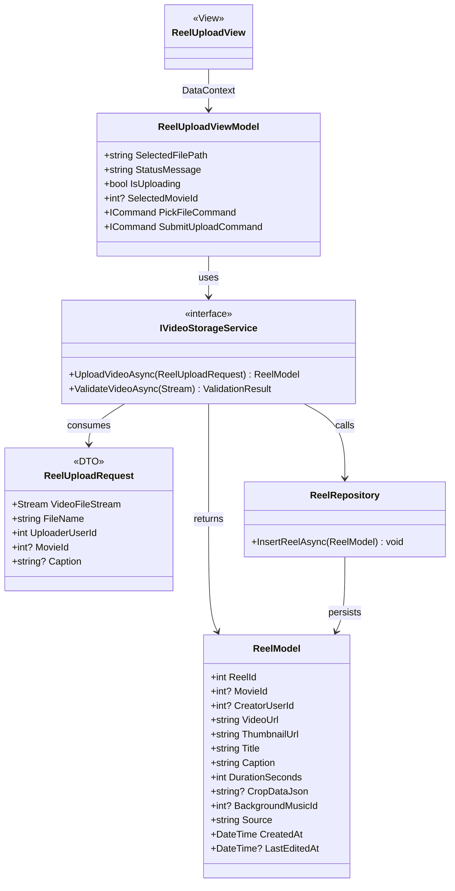

# Class Diagram — Alex (Reel Upload)

```mermaid
classDiagram
    direction TB

    %% ── Models ──
    class ReelModel {
        +int ReelId
        +int? MovieId
        +int? CreatorUserId
        +string VideoUrl
        +string ThumbnailUrl
        +string Title
        +string Caption
        +int DurationSeconds
        +string? CropDataJson
        +int? BackgroundMusicId
        +string Source
        +DateTime CreatedAt
        +DateTime? LastEditedAt
    }

    class ReelUploadRequest {
        <<DTO>>
        +Stream VideoFileStream
        +string FileName
        +int UploaderUserId
        +int? MovieId
        +string? Caption
    }

    %% ── Services ──
    class IVideoStorageService {
        <<interface>>
        +UploadVideoAsync(ReelUploadRequest) ReelModel
        +ValidateVideoAsync(Stream) ValidationResult
    }

    class ReelRepository {
        +InsertReelAsync(ReelModel) void
    }

    %% ── ViewModel ──
    class ReelUploadViewModel {
        +string SelectedFilePath
        +string StatusMessage
        +bool IsUploading
        +int? SelectedMovieId
        +ICommand PickFileCommand
        +ICommand SubmitUploadCommand
    }

    %% ── View ──
    class ReelUploadView {
        <<View>>
    }

    %% ── Relationships ──
    ReelUploadView --> ReelUploadViewModel : DataContext
    ReelUploadViewModel --> IVideoStorageService : uses
    IVideoStorageService --> ReelModel : returns
    IVideoStorageService --> ReelUploadRequest : consumes
    ReelRepository --> ReelModel : persists
    IVideoStorageService --> ReelRepository : calls
```
