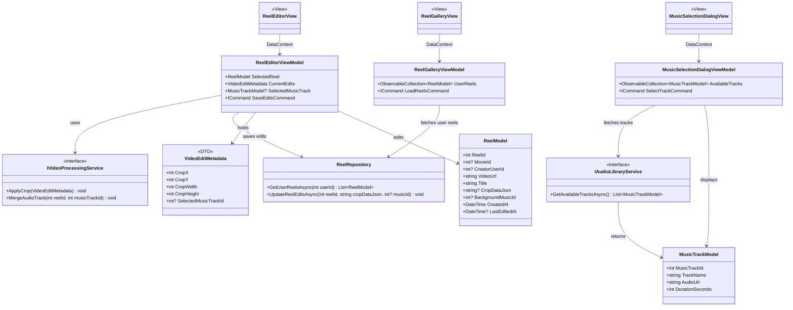

# Class Diagram — Beatrice (Reel Editing)

```mermaid
classDiagram
    direction TB

    %% ── Models ──
    class ReelModel {
        +int ReelId
        +int? MovieId
        +int? CreatorUserId
        +string VideoUrl
        +string Title
        +string? CropDataJson
        +int? BackgroundMusicId
        +DateTime CreatedAt
        +DateTime? LastEditedAt
    }

    class MusicTrackModel {
        +int MusicTrackId
        +string TrackName
        +string AudioUrl
        +int DurationSeconds
    }

    class VideoEditMetadata {
        <<DTO>>
        +int CropX
        +int CropY
        +int CropWidth
        +int CropHeight
        +int? SelectedMusicTrackId
    }

    %% ── Services ──
    class IVideoProcessingService {
        <<interface>>
        +ApplyCrop(VideoEditMetadata) void
        +MergeAudioTrack(int reelId, int musicTrackId) void
    }

    class IAudioLibraryService {
        <<interface>>
        +GetAvailableTracksAsync() List~MusicTrackModel~
    }

    class ReelRepository {
        +GetUserReelsAsync(int userId) List~ReelModel~
        +UpdateReelEditsAsync(int reelId, string cropDataJson, int? musicId) void
    }

    %% ── ViewModels ──
    class ReelGalleryViewModel {
        +ObservableCollection~ReelModel~ UserReels
        +ICommand LoadReelsCommand
    }

    class ReelEditorViewModel {
        +ReelModel SelectedReel
        +VideoEditMetadata CurrentEdits
        +MusicTrackModel? SelectedMusicTrack
        +ICommand SaveEditsCommand
    }

    class MusicSelectionDialogViewModel {
        +ObservableCollection~MusicTrackModel~ AvailableTracks
        +ICommand SelectTrackCommand
    }

    %% ── Views ──
    class ReelGalleryView {
        <<View>>
    }

    class ReelEditorView {
        <<View>>
    }

    class MusicSelectionDialogView {
        <<View>>
    }

    %% ── Relationships ──
    ReelGalleryView --> ReelGalleryViewModel : DataContext
    ReelEditorView --> ReelEditorViewModel : DataContext
    MusicSelectionDialogView --> MusicSelectionDialogViewModel : DataContext

    ReelGalleryViewModel --> ReelRepository : fetches user reels
    ReelEditorViewModel --> IVideoProcessingService : uses
    ReelEditorViewModel --> ReelRepository : saves edits
    ReelEditorViewModel --> VideoEditMetadata : holds
    MusicSelectionDialogViewModel --> IAudioLibraryService : fetches tracks
    IAudioLibraryService --> MusicTrackModel : returns
    ReelEditorViewModel --> ReelModel : edits
    MusicSelectionDialogViewModel --> MusicTrackModel : displays
```
