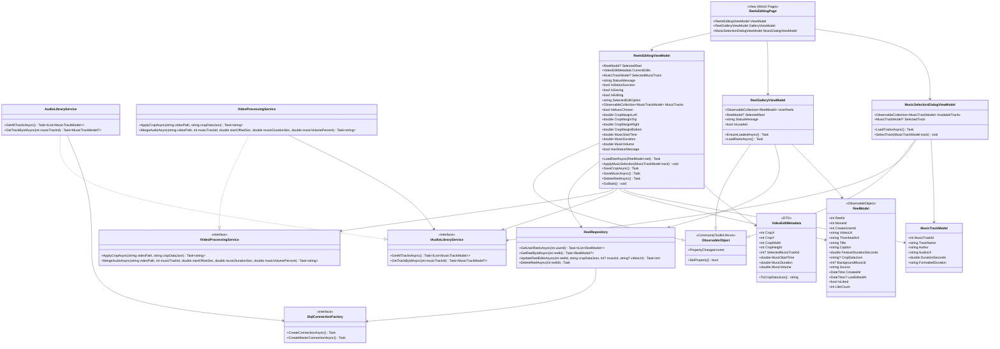

# Class Diagram - Beatrice (Reels Editing)

```mermaid
classDiagram
    direction TB

    %% Models / DTO
    class ReelModel {
        <<ObservableObject>>
        +int ReelId
        +int MovieId
        +int CreatorUserId
        +string VideoUrl
        +string ThumbnailUrl
        +string Title
        +string Caption
        +double FeatureDurationSeconds
        +string? CropDataJson
        +int? BackgroundMusicId
        +string Source
        +DateTime CreatedAt
        +DateTime? LastEditedAt
        +bool IsLiked
        +int LikeCount
    }

    class MusicTrackModel {
        +int MusicTrackId
        +string TrackName
        +string Author
        +string AudioUrl
        +double DurationSeconds
        +string FormattedDuration
    }

    class VideoEditMetadata {
        <<DTO>>
        +int CropX
        +int CropY
        +int CropWidth
        +int CropHeight
        +int? SelectedMusicTrackId
        +double MusicStartTime
        +double MusicDuration
        +double MusicVolume
        +ToCropDataJson() string
    }

    %% Data access / services
    class ISqlConnectionFactory {
        <<interface>>
        +CreateConnectionAsync() Task
        +CreateMasterConnectionAsync() Task
    }

    class ReelRepository {
        +GetUserReelsAsync(int userId) Task~IList~ReelModel~~
        +GetReelByIdAsync(int reelId) Task~ReelModel?~
        +UpdateReelEditsAsync(int reelId, string cropDataJson, int? musicId, string? videoUrl) Task~int~
        +DeleteReelAsync(int reelId) Task
    }

    class IAudioLibraryService {
        <<interface>>
        +GetAllTracksAsync() Task~IList~MusicTrackModel~~
        +GetTrackByIdAsync(int musicTrackId) Task~MusicTrackModel?~
    }

    class AudioLibraryService {
        +GetAllTracksAsync() Task~IList~MusicTrackModel~~
        +GetTrackByIdAsync(int musicTrackId) Task~MusicTrackModel?~
    }

    class IVideoProcessingService {
        <<interface>>
        +ApplyCropAsync(string videoPath, string cropDataJson) Task~string~
        +MergeAudioAsync(string videoPath, int musicTrackId, double startOffsetSec, double musicDurationSec, double musicVolumePercent) Task~string~
    }

    class VideoProcessingService {
        +ApplyCropAsync(string videoPath, string cropDataJson) Task~string~
        +MergeAudioAsync(string videoPath, int musicTrackId, double startOffsetSec, double musicDurationSec, double musicVolumePercent) Task~string~
    }

    AudioLibraryService ..|> IAudioLibraryService
    VideoProcessingService ..|> IVideoProcessingService
    ReelRepository --> ISqlConnectionFactory
    AudioLibraryService --> ISqlConnectionFactory
    VideoProcessingService --> IAudioLibraryService

    %% ViewModels
    class ObservableObject {
        <<CommunityToolkit.Mvvm>>
        +PropertyChanged event
        +SetProperty() bool
    }

    class ReelGalleryViewModel {
        +ObservableCollection~ReelModel~ UserReels
        +ReelModel? SelectedReel
        +string StatusMessage
        +bool IsLoaded
        +EnsureLoadedAsync() Task
        +LoadReelsAsync() Task
    }

    class ReelsEditingViewModel {
        +ReelModel? SelectedReel
        +VideoEditMetadata CurrentEdits
        +MusicTrackModel? SelectedMusicTrack
        +string StatusMessage
        +bool IsStatusSuccess
        +bool IsSaving
        +bool IsEditing
        +string SelectedEditOption
        +ObservableCollection~MusicTrackModel~ MusicTracks
        +bool IsMusicChosen
        +double CropMarginLeft
        +double CropMarginTop
        +double CropMarginRight
        +double CropMarginBottom
        +double MusicStartTime
        +double MusicDuration
        +double MusicVolume
        +bool HasStatusMessage
        +LoadReelAsync(ReelModel reel) Task
        +ApplyMusicSelection(MusicTrackModel track) void
        +SaveCropAsync() Task
        +SaveMusicAsync() Task
        +DeleteReelAsync() Task
        +GoBack() void
    }

    class MusicSelectionDialogViewModel {
        +ObservableCollection~MusicTrackModel~ AvailableTracks
        +MusicTrackModel? SelectedTrack
        +LoadTracksAsync() Task
        +SelectTrack(MusicTrackModel track) void
    }

    ReelGalleryViewModel --|> ObservableObject
    ReelsEditingViewModel --|> ObservableObject
    MusicSelectionDialogViewModel --|> ObservableObject

    ReelGalleryViewModel --> ReelRepository
    ReelsEditingViewModel --> ReelRepository
    ReelsEditingViewModel --> IVideoProcessingService
    ReelsEditingViewModel --> IAudioLibraryService
    MusicSelectionDialogViewModel --> IAudioLibraryService

    ReelsEditingViewModel --> ReelModel
    ReelsEditingViewModel --> MusicTrackModel
    ReelsEditingViewModel --> VideoEditMetadata
    ReelGalleryViewModel --> ReelModel
    MusicSelectionDialogViewModel --> MusicTrackModel

    %% View
    class ReelsEditingPage {
        <<View (WinUI Page)>>
        +ReelsEditingViewModel ViewModel
        +ReelGalleryViewModel GalleryViewModel
        +MusicSelectionDialogViewModel MusicDialogViewModel
    }

    ReelsEditingPage --> ReelsEditingViewModel
    ReelsEditingPage --> ReelGalleryViewModel
    ReelsEditingPage --> MusicSelectionDialogViewModel
```
