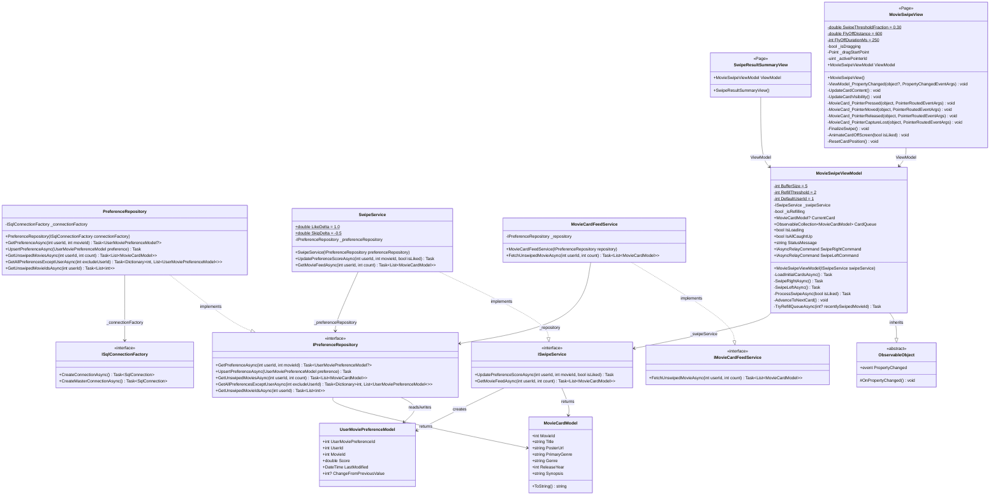

# Class Diagram — Bogdan (Movie Swipe / Movie Tinder)

```mermaid
classDiagram
    direction TB

    %% ══════════════════════════════════════
    %%  MODELS
    %% ══════════════════════════════════════

    class MovieCardModel {
        +int MovieId
        +string Title
        +string PosterUrl
        +string PrimaryGenre
        +string Genre
        +int ReleaseYear
        +string Synopsis
        +ToString() string
    }

    class UserMoviePreferenceModel {
        +int UserMoviePreferenceId
        +int UserId
        +int MovieId
        +double Score
        +DateTime LastModified
        +int? ChangeFromPreviousValue
    }

    %% ══════════════════════════════════════
    %%  REPOSITORIES
    %% ══════════════════════════════════════

    class IPreferenceRepository {
        <<interface>>
        +GetPreferenceAsync(int userId, int movieId) Task~UserMoviePreferenceModel?~
        +UpsertPreferenceAsync(UserMoviePreferenceModel preference) Task
        +GetUnswipedMoviesAsync(int userId, int count) Task~List~MovieCardModel~~
        +GetAllPreferencesExceptUserAsync(int excludeUserId) Task~Dictionary~int, List~UserMoviePreferenceModel~~~
        +GetUnswipedMovieIdsAsync(int userId) Task~List~int~~
    }

    class PreferenceRepository {
        -ISqlConnectionFactory _connectionFactory
        +PreferenceRepository(ISqlConnectionFactory connectionFactory)
        +GetPreferenceAsync(int userId, int movieId) Task~UserMoviePreferenceModel?~
        +UpsertPreferenceAsync(UserMoviePreferenceModel preference) Task
        +GetUnswipedMoviesAsync(int userId, int count) Task~List~MovieCardModel~~
        +GetAllPreferencesExceptUserAsync(int excludeUserId) Task~Dictionary~int, List~UserMoviePreferenceModel~~~
        +GetUnswipedMovieIdsAsync(int userId) Task~List~int~~
    }

    class ISqlConnectionFactory {
        <<interface>>
        +CreateConnectionAsync() Task~SqlConnection~
        +CreateMasterConnectionAsync() Task~SqlConnection~
    }

    %% ══════════════════════════════════════
    %%  SERVICES
    %% ══════════════════════════════════════

    class ISwipeService {
        <<interface>>
        +UpdatePreferenceScoreAsync(int userId, int movieId, bool isLiked) Task
        +GetMovieFeedAsync(int userId, int count) Task~List~MovieCardModel~~
    }

    class SwipeService {
        +double LikeDelta = 1.0$
        +double SkipDelta = -0.5$
        -IPreferenceRepository _preferenceRepository
        +SwipeService(IPreferenceRepository preferenceRepository)
        +UpdatePreferenceScoreAsync(int userId, int movieId, bool isLiked) Task
        +GetMovieFeedAsync(int userId, int count) Task~List~MovieCardModel~~
    }

    class IMovieCardFeedService {
        <<interface>>
        +FetchUnswipedMovieAsync(int userId, int count) Task~List~MovieCardModel~~
    }

    class MovieCardFeedService {
        -IPreferenceRepository _repository
        +MovieCardFeedService(IPreferenceRepository repository)
        +FetchUnswipedMovieAsync(int userId, int count) Task~List~MovieCardModel~~
    }

    %% ══════════════════════════════════════
    %%  VIEWMODEL
    %% ══════════════════════════════════════

    class ObservableObject {
        <<abstract>>
        +event PropertyChanged
        #OnPropertyChanged() void
    }

    class MovieSwipeViewModel {
        -int BufferSize = 5$
        -int RefillThreshold = 2$
        -int DefaultUserId = 1$
        -ISwipeService _swipeService
        -bool _isRefilling
        +MovieCardModel? CurrentCard
        +ObservableCollection~MovieCardModel~ CardQueue
        +bool IsLoading
        +bool IsAllCaughtUp
        +string StatusMessage
        +IAsyncRelayCommand SwipeRightCommand
        +IAsyncRelayCommand SwipeLeftCommand
        +MovieSwipeViewModel(ISwipeService swipeService)
        -LoadInitialCardsAsync() Task
        -SwipeRightAsync() Task
        -SwipeLeftAsync() Task
        -ProcessSwipeAsync(bool isLiked) Task
        -AdvanceToNextCard() void
        -TryRefillQueueAsync(int? recentlySwipedMovieId) Task
    }

    %% ══════════════════════════════════════
    %%  VIEWS
    %% ══════════════════════════════════════

    class MovieSwipeView {
        <<Page>>
        -double SwipeThresholdFraction = 0.30$
        -double FlyOffDistance = 600$
        -int FlyOffDurationMs = 250$
        -bool _isDragging
        -Point _dragStartPoint
        -uint _activePointerId
        +MovieSwipeViewModel ViewModel
        +MovieSwipeView()
        -ViewModel_PropertyChanged(object?, PropertyChangedEventArgs) void
        -UpdateCardContent() void
        -UpdateCardVisibility() void
        -MovieCard_PointerPressed(object, PointerRoutedEventArgs) void
        -MovieCard_PointerMoved(object, PointerRoutedEventArgs) void
        -MovieCard_PointerReleased(object, PointerRoutedEventArgs) void
        -MovieCard_PointerCaptureLost(object, PointerRoutedEventArgs) void
        -FinalizeSwipe() void
        -AnimateCardOffScreen(bool isLiked) void
        -ResetCardPosition() void
    }

    class SwipeResultSummaryView {
        <<Page>>
        +MovieSwipeViewModel ViewModel
        +SwipeResultSummaryView()
    }

    %% ══════════════════════════════════════
    %%  RELATIONSHIPS
    %% ══════════════════════════════════════

    %% Inheritance / Implementation
    PreferenceRepository ..|> IPreferenceRepository : implements
    SwipeService ..|> ISwipeService : implements
    MovieCardFeedService ..|> IMovieCardFeedService : implements
    MovieSwipeViewModel --|> ObservableObject : inherits

    %% View → ViewModel
    MovieSwipeView --> MovieSwipeViewModel : ViewModel
    SwipeResultSummaryView --> MovieSwipeViewModel : ViewModel

    %% ViewModel → Service
    MovieSwipeViewModel --> ISwipeService : _swipeService

    %% Service → Repository
    SwipeService --> IPreferenceRepository : _preferenceRepository
    MovieCardFeedService --> IPreferenceRepository : _repository

    %% Repository → Infrastructure
    PreferenceRepository --> ISqlConnectionFactory : _connectionFactory

    %% Data flow
    IPreferenceRepository --> UserMoviePreferenceModel : reads/writes
    IPreferenceRepository --> MovieCardModel : returns
    ISwipeService --> MovieCardModel : returns
    ISwipeService --> UserMoviePreferenceModel : creates
```
