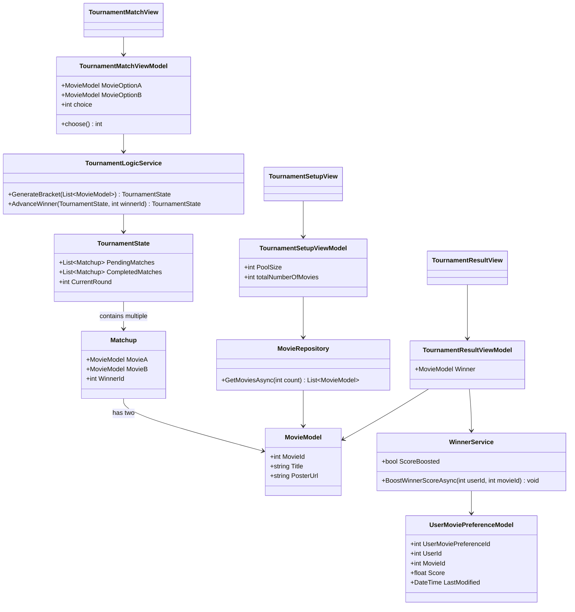

# Class Diagram — Gabi (Movie Tournament)

```mermaid
classDiagram
    direction TB

    %% ── Models ──
    class MovieModel {
        +int MovieId
        +string Title
        +string PosterUrl
    }

    class UserMoviePreferenceModel {
        +int UserMoviePreferenceId
        +int UserId
        +int MovieId
        +float Score
        +DateTime LastModified
    }

    class TournamentState {
        
        +List~Matchup~ PendingMatches
        +List~Matchup~ CompletedMatches
        +int CurrentRound
    }

    class Matchup {
        +MovieModel MovieA
        +MovieModel MovieB
        +int WinnerId
    }

    TournamentState -->  Matchup : contains multiple
    Matchup -->  MovieModel : has two

    %% ── Services ──
    class TournamentLogicService {
        +GenerateBracket(List~MovieModel~) TournamentState
        +AdvanceWinner(TournamentState, int winnerId) TournamentState
    }

    class MovieRepository {
        +GetMoviesAsync(int count) List~MovieModel~
    }

    class WinnerService {
        +BoostWinnerScoreAsync(int userId, int movieId) void
        +bool ScoreBoosted
    }    

    %% ── ViewModels ──
    class TournamentSetupViewModel {
        +int PoolSize
        +int totalNumberOfMovies
        
    }

    class TournamentMatchViewModel {
        +MovieModel MovieOptionA
        +MovieModel MovieOptionB
        +int choice
        +choose() int
    }

    class TournamentResultViewModel {
        +MovieModel Winner
        
    }

    %% ── Views ──
    class TournamentSetupView {
        
    }

    class TournamentMatchView {
      
    }

    class TournamentResultView {
    
    }

    %% ── Relationships ──
    TournamentSetupView --> TournamentSetupViewModel 
    TournamentMatchView --> TournamentMatchViewModel 
    TournamentResultView --> TournamentResultViewModel 
    TournamentResultViewModel -->MovieModel
    TournamentSetupViewModel --> MovieRepository 
    TournamentMatchViewModel --> TournamentLogicService 
     
    TournamentResultViewModel --> WinnerService 
    TournamentLogicService --> TournamentState 
    MovieRepository -->MovieModel
    WinnerService --> UserMoviePreferenceModel 
    
```
