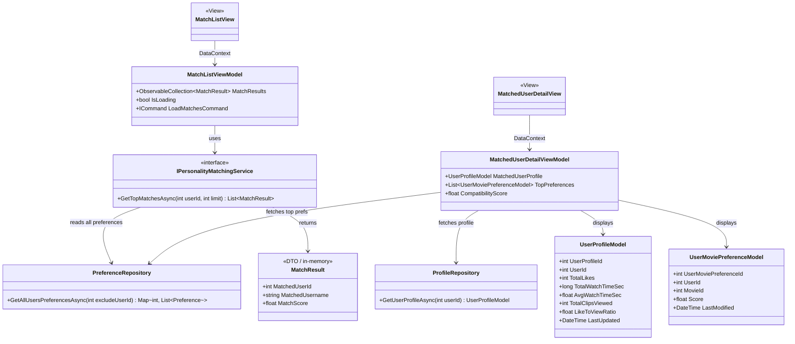

# Class Diagram — Madi (Personality Matching)

```mermaid
classDiagram
    direction TB

    %% ── Models ──
    class UserMoviePreferenceModel {
        +int UserMoviePreferenceId
        +int UserId
        +int MovieId
        +float Score
        +DateTime LastModified
    }

    class UserProfileModel {
        +int UserProfileId
        +int UserId
        +int TotalLikes
        +long TotalWatchTimeSec
        +float AvgWatchTimeSec
        +int TotalClipsViewed
        +float LikeToViewRatio
        +DateTime LastUpdated
    }

    class MatchResult {
        <<DTO / in-memory>>
        +int MatchedUserId
        +string MatchedUsername
        +float MatchScore
    }

    %% ── Services ──
    class IPersonalityMatchingService {
        <<interface>>
        +GetTopMatchesAsync(int userId, int limit) List~MatchResult~
    }

    class PreferenceRepository {
        +GetAllUsersPreferencesAsync(int excludeUserId) Map~int, List~Preference~~
    }

    class ProfileRepository {
        +GetUserProfileAsync(int userId) UserProfileModel
    }

    %% ── ViewModels ──
    class MatchListViewModel {
        +ObservableCollection~MatchResult~ MatchResults
        +bool IsLoading
        +ICommand LoadMatchesCommand
    }

    class MatchedUserDetailViewModel {
        +UserProfileModel MatchedUserProfile
        +List~UserMoviePreferenceModel~ TopPreferences
        +float CompatibilityScore
    }

    %% ── Views ──
    class MatchListView {
        <<View>>
    }

    class MatchedUserDetailView {
        <<View>>
    }

    %% ── Relationships ──
    MatchListView --> MatchListViewModel : DataContext
    MatchedUserDetailView --> MatchedUserDetailViewModel : DataContext

    MatchListViewModel --> IPersonalityMatchingService : uses
    IPersonalityMatchingService --> PreferenceRepository : reads all preferences
    IPersonalityMatchingService --> MatchResult : returns
    MatchedUserDetailViewModel --> ProfileRepository : fetches profile
    MatchedUserDetailViewModel --> PreferenceRepository : fetches top prefs
    MatchedUserDetailViewModel --> UserProfileModel : displays
    MatchedUserDetailViewModel --> UserMoviePreferenceModel : displays
```
