# UML Class Diagram — Movie & Personality Application (MVVM)

```mermaid
classDiagram
    direction TB

    %% ══════════════════════════════════════
    %%  SHARED MODELS (Database-backed)
    %% ══════════════════════════════════════

    class ReelModel {
        <<ObservableObject>>
        +int ReelId
        +int MovieId
        +int CreatorUserId
        +string VideoUrl
        +string ThumbnailUrl
        +string Title
        +string Caption
        +double FeatureDurationSeconds
        +string? CropDataJson
        +int? BackgroundMusicId
        +string Source
        +string? Genre
        +DateTime CreatedAt
        +DateTime? LastEditedAt
        +bool IsLiked
        +int LikeCount
    }

    class UserMoviePreferenceModel {
        +int UserMoviePreferenceId
        +int UserId
        +int MovieId
        +double Score
        +DateTime LastModified
        +int? ChangeFromPreviousValue
    }

    class UserProfileModel {
        +int UserProfileId
        +int UserId
        +int TotalLikes
        +long TotalWatchTimeSec
        +double AvgWatchTimeSec
        +int TotalClipsViewed
        +double LikeToViewRatio
        +DateTime LastUpdated
    }

    class UserReelInteractionModel {
        +long InteractionId
        +int UserId
        +int ReelId
        +bool IsLiked
        +double WatchDurationSec
        +double WatchPercentage
        +DateTime ViewedAt
    }

    class MusicTrackModel {
        +int MusicTrackId
        +string TrackName
        +string Author
        +string AudioUrl
        +double DurationSeconds
        +string FormattedDuration
    }

    class MovieCardModel {
        +int MovieId
        +string Title
        +string PosterUrl
        +string PrimaryGenre
    }

    class MovieModel {
        +int MovieId
        +string Title
        +string PosterUrl
    }

    %% ══════════════════════════════════════
    %%  IN-MEMORY / DTOs
    %% ══════════════════════════════════════

    class TournamentState {
        +List~Matchup~ PendingMatches
        +List~Matchup~ CompletedMatches
        +int CurrentRound
    }

    class Matchup {
        +MovieModel MovieA
        +MovieModel MovieB
        +int WinnerId
        +int orderNumber
    }

    class MatchResult {
        +int MatchedUserId
        +string MatchedUsername
        +float MatchScore
    }

    class ReelUploadRequest {
        +Stream VideoFileStream
        +string FileName
        +int UploaderUserId
        +int? MovieId
        +string? Caption
    }

    class VideoEditMetadata {
        +int CropX
        +int CropY
        +int CropWidth
        +int CropHeight
        +int? SelectedMusicTrackId
        +double MusicStartTime
        +double MusicDuration
        +double MusicVolume
        +ToCropDataJson() string
    }

    TournamentState --> "contains multiple" Matchup
    Matchup --> "contains 2" MovieModel

    %% ══════════════════════════════════════
    %%  SERVICES & REPOSITORIES
    %% ══════════════════════════════════════


    class IUserSession {
        <<interface>>
        +int CurrentUserId
        +bool IsAuthenticated
    }

    class IReelRepository {
        <<interface>>
        +InsertReelAsync(ReelModel) void
        +BulkInsertScrapedReelsAsync(List~ReelModel~) void
        +UpdateReelCropAndMusicAsync(int reelId, string cropJson, int musicId) void
        +GetReelsByUserIdAsync(int userId) List~ReelModel~
        +GetReelsByMovieIdAsync(int movieId, string source) List~ReelModel~
    }

    class IMusicTrackRepository {
        <<interface>>
        +GetAllTracksAsync() List~MusicTrackModel~
    }

    class IPreferenceRepository {
        <<interface>>
        +UpsertPreferenceAsync(UserMoviePreferenceModel) void
        +GetAllPreferencesExceptUserAsync(int excludeUserId) Dictionary~int, List~UserMoviePreferenceModel~~
        +GetUnswipedMovieIdsAsync(int userId) List~int~
    }

    class IProfileRepository {
        <<interface>>
        +GetProfileAsync(int userId) UserProfileModel?
        +UpsertProfileAsync(UserProfileModel) void
    }

    class IInteractionRepository {
        <<interface>>
        +InsertInteractionAsync(UserReelInteractionModel) void
        +UpsertInteractionAsync(int userId, int reelId) void
        +ToggleLikeAsync(int userId, int reelId) void
        +UpdateViewDataAsync(int userId, int reelId, double watchDurationSec, double watchPercentage) void
        +GetInteractionAsync(int userId, int reelId) UserReelInteractionModel?
        +GetLikeCountAsync(int reelId) int
        +GetReelMovieIdAsync(int reelId) int?
    }

    class IReelFeedPreferenceRepository {
        <<interface>>
        +BoostPreferenceOnLikeAsync(int userId, int movieId) void
    }

    class IMovieRepository {
        <<interface>>
        +GetRandomMoviesAsync(int count) List~MovieModel~
    }


    class IVideoStorageService {
        <<interface>>
        +UploadVideoAsync(ReelUploadRequest) ReelModel
        +ValidateVideoAsync(Stream) ValidationResult
    }

    class IWebScraperService {
        <<interface>>
        +ScrapeVideosForMovieAsync(string movieTitle) List~RawVideo~
    }

    class VideoIngestionService {
        +IngestTrailersAsync() void
    }

    class WebScraperBackgroundService {
        +ExecuteAsync() void
    }

    class IVideoProcessingService {
        <<interface>>
        +ApplyCropAsync(string videoPath, string cropDataJson) Task~string~
        +MergeAudioAsync(string videoPath, int musicTrackId, double startOffsetSec, double musicDurationSec, double musicVolumePercent) Task~string~
    }

    class IAudioLibraryService {
        <<interface>>
        +GetAllTracksAsync() Task~IList~MusicTrackModel~~
        +GetTrackByIdAsync(int musicTrackId) Task~MusicTrackModel?~
    }

    class ISqlConnectionFactory {
        <<interface>>
        +CreateConnectionAsync() Task
        +CreateMasterConnectionAsync() Task
    }

    class ReelRepository {
        +GetUserReelsAsync(int userId) Task~IList~ReelModel~~
        +GetReelByIdAsync(int reelId) Task~ReelModel?~
        +UpdateReelEditsAsync(int reelId, string cropDataJson, int? musicId, string? videoUrl) Task~int~
        +DeleteReelAsync(int reelId) Task
    }

    class AudioLibraryService {
        +GetAllTracksAsync() Task~IList~MusicTrackModel~~
        +GetTrackByIdAsync(int musicTrackId) Task~MusicTrackModel?~
    }

    class VideoProcessingService {
        +ApplyCropAsync(string videoPath, string cropDataJson) Task~string~
        +MergeAudioAsync(string videoPath, int musicTrackId, double startOffsetSec, double musicDurationSec, double musicVolumePercent) Task~string~
    }

    class ISwipeService {
        <<interface>>
        +UpdatePreferenceScoreAsync(int userId, int movieId, bool isLiked) void
        +GetMovieFeedAsync(int userId, int count) List~MovieCardModel~
    }

    class IMovieCardFeedService {
        <<interface>>
        +FetchMovieFeedAsync(int userId, int count) List~MovieCardModel~
    }

    class MovieCardFeedService {
        +FetchMovieFeedAsync(int userId, int count) List~MovieCardModel~
    }

    class SwipeService {
        +UpdatePreferenceScoreAsync(int userId, int movieId, bool isLiked) void
        +GetMovieFeedAsync(int userId, int count) List~MovieCardModel~
    }

    class TournamentLogicService {
        +GenerateBracket(List~MovieModel~) TournamentState
        +AdvanceWinner(TournamentState, int winnerId) TournamentState
    }

    class IPersonalityMatchingService {
        <<interface>>
        +GetTopMatchesAsync(int userId, int limit) List~MatchResult~
    }

    class IReelInteractionService {
        <<interface>>
        +ToggleLikeAsync(int userId, int reelId) void
        +RecordViewAsync(int userId, int reelId, double watchDurationSec, double watchPercentage) void
        +GetInteractionAsync(int userId, int reelId) UserReelInteractionModel?
        +GetLikeCountAsync(int reelId) int
    }

    class IEngagementProfileService {
        <<interface>>
        +GetProfileAsync(int userId) UserProfileModel?
        +RefreshProfileAsync(int userId) void
    }

    class IRecommendationService {
        <<interface>>
        +GetRecommendedReelsAsync(int userId, int count) IList~ReelModel~
    }

    class IClipPlaybackService {
        <<interface>>
        +PlayAsync(string videoUrl) void
        +PauseAsync() void
        +ResumeAsync() void
        +SeekAsync(double positionSeconds) void
        +GetElapsedSeconds() double
        +PrefetchClipAsync(string videoUrl) void
        +IsPlaying bool
    }

    SwipeService ..|> ISwipeService
    VideoIngestionService --> IWebScraperService
    TournamentLogicService --> TournamentState

    %% ══════════════════════════════════════
    %%  VIEWMODELS
    %% ══════════════════════════════════════

    class ViewModelBase {
        <<abstract>>
        +event PropertyChanged
        #OnPropertyChanged() void
    }

    class ObservableObject {
        <<CommunityToolkit.Mvvm>>
        +event PropertyChanged
        #OnPropertyChanged() void
        #SetProperty() bool
    }

    class ReelUploadViewModel {
        +string SelectedFilePath
        +string StatusMessage
        +bool IsUploading
        +int? SelectedMovieId
        +ICommand PickFileCommand
        +ICommand SubmitUploadCommand
    }

    class MovieTrailerPlayerViewModel {
        +ObservableCollection~ReelModel~ Trailers
        +string SelectedVideoUrl
        +LoadTrailersCommand(int movieId)
    }

    class ReelGalleryViewModel {
        +ObservableCollection~ReelModel~ UserReels
        +ReelModel? SelectedReel
        +string StatusMessage
        +bool IsLoaded
        +EnsureLoadedAsync() Task
        +LoadReelsAsync() Task
    }

    class ReelsEditingViewModel {
        +ReelModel? SelectedReel
        +VideoEditMetadata CurrentEdits
        +MusicTrackModel? SelectedMusicTrack
        +string StatusMessage
        +bool IsStatusSuccess
        +bool IsSaving
        +bool IsEditing
        +string SelectedEditOption
        +ObservableCollection~MusicTrackModel~ MusicTracks
        +bool IsMusicChosen
        +double CropMarginLeft
        +double CropMarginTop
        +double CropMarginRight
        +double CropMarginBottom
        +double MusicStartTime
        +double MusicDuration
        +double MusicVolume
        +bool HasStatusMessage
        +SelectEditOption(string option) void
        +LoadReelAsync(ReelModel reel) Task
        +GoBack() void
        +ApplyMusicSelection(MusicTrackModel track) void
        +SaveCropAsync() Task
        +SaveMusicAsync() Task
        +DeleteReelAsync() Task
    }

    class MusicSelectionDialogViewModel {
        +ObservableCollection~MusicTrackModel~ AvailableTracks
        +MusicTrackModel? SelectedTrack
        +LoadTracksAsync() Task
        +SelectTrack(MusicTrackModel track) void
    }

    class MovieSwipeViewModel {
        +MovieCardModel CurrentCard
        +ObservableCollection~MovieCardModel~ CardQueue
        +bool IsLoading
        +ICommand SwipeRightCommand
        +ICommand SwipeLeftCommand
    }

    class TournamentSetupViewModel {
        +int PoolSize
        +int maxSize
        
    }

    class TournamentMatchViewModel {
        +MovieModel MovieOptionA
        +MovieModel MovieOptionB
        
    }

    class TournamentResultViewModel {
        +MovieModel Winner
        
    }

    class MatchListViewModel {
        +ObservableCollection~MatchResult~ MatchResults
        +bool IsLoading
        +ICommand LoadMatchesCommand
    }

    class MatchedUserDetailViewModel {
        +UserProfileModel MatchedUserProfile
        +List~UserMoviePreferenceModel~ TopPreferences
        +float CompatibilityScore
    }

    class ReelsFeedViewModel {
        <<ObservableObject>>
        +string PageTitle
        +string StatusMessage
        +bool IsLoading
        +string? ErrorMessage
        +bool IsEmpty
        +bool HasError
        +ReelModel? CurrentReel
        +ObservableCollection~ReelModel~ ReelQueue
        +LoadFeedAsync() void
        +ScrollNext(ReelModel newCurrent) void
        +ScrollPrevious(ReelModel newCurrent) void
        +OnNavigatingAway() void
    }

    class UserProfileViewModel {
        <<ObservableObject>>
        +UserProfileModel? Profile
        +bool IsLoading
        +string? ErrorMessage
        +LoadProfileAsync(int userId) void
    }

    ReelUploadViewModel --|> ViewModelBase
    MovieTrailerPlayerViewModel --|> ViewModelBase
    ReelGalleryViewModel --|> ObservableObject
    ReelsEditingViewModel --|> ObservableObject
    MusicSelectionDialogViewModel --|> ObservableObject
    MovieSwipeViewModel --|> ViewModelBase
    TournamentSetupViewModel --|> ViewModelBase
    TournamentMatchViewModel --|> ViewModelBase
    TournamentResultViewModel --|> ViewModelBase
    MatchListViewModel --|> ViewModelBase
    MatchedUserDetailViewModel --|> ViewModelBase
    ReelsFeedViewModel --|> ObservableObject
    UserProfileViewModel --|> ObservableObject

    %% ── ViewModel → Service dependencies ──
    ReelUploadViewModel --> IVideoStorageService
    ReelUploadViewModel --> IUserSession
    MovieTrailerPlayerViewModel --> IReelRepository
    ReelGalleryViewModel --> ReelRepository
    ReelsEditingViewModel --> IVideoProcessingService
    ReelsEditingViewModel --> IAudioLibraryService
    ReelsEditingViewModel --> ReelRepository
    MusicSelectionDialogViewModel --> IAudioLibraryService
    MovieSwipeViewModel --> ISwipeService
    MovieSwipeViewModel --> IUserSession
    TournamentSetupViewModel --> IMovieRepository
    TournamentMatchViewModel --> TournamentLogicService


    MatchListViewModel --> IPersonalityMatchingService
    MatchedUserDetailViewModel --> IEngagementProfileService
    ReelsFeedViewModel --> IReelInteractionService
    ReelsFeedViewModel --> IRecommendationService
    ReelsFeedViewModel --> IClipPlaybackService
    UserProfileViewModel --> IEngagementProfileService

    %% ── Service → Repository dependencies ──
    SwipeService --> IPreferenceRepository
    SwipeService --> IMovieRepository
    VideoIngestionService --> IReelRepository
    PersonalityMatchingService --> IPreferenceRepository
    PersonalityMatchingService --> IUserProfileRepository
    ReelInteractionService --> IInteractionRepository
    ReelInteractionService --> IReelFeedPreferenceRepository
    EngagementProfileService --> IProfileRepository
    ReelRepository --> ISqlConnectionFactory
    AudioLibraryService --> ISqlConnectionFactory
    AudioLibraryService ..|> IAudioLibraryService
    VideoProcessingService ..|> IVideoProcessingService
    VideoProcessingService --> IAudioLibraryService

    %% ══════════════════════════════════════
    %%  VIEWS
    %% ══════════════════════════════════════

    class ReelUploadView {
        <<View>>
    }

    class MovieTrailerPlayerView {
        <<View>>
    }

    class ReelsEditingPage {
        <<View>>
    }

    class MovieSwipeView {
        <<View>>
    }

    class SwipeResultSummaryView {
        <<View>>
    }

    class TournamentSetupView {
        <<View>>
    }

    class TournamentMatchView {
        <<View>>
    }

    class TournamentResultView {
        <<View>>
    }

    class MatchListView {
        <<View>>
    }

    class MatchedUserDetailView {
        <<View>>
    }

    class ReelsFeedPage {
        <<View>>
    }

    class ReelItemView {
        <<View>>
    }

    %% ── View → ViewModel bindings ──
    ReelUploadView --> ReelUploadViewModel
    MovieTrailerPlayerView --> MovieTrailerPlayerViewModel
    ReelsEditingPage --> ReelGalleryViewModel
    ReelsEditingPage --> ReelsEditingViewModel
    ReelsEditingPage --> MusicSelectionDialogViewModel
    MovieSwipeView --> MovieSwipeViewModel
    SwipeResultSummaryView --> MovieSwipeViewModel
    TournamentSetupView --> TournamentSetupViewModel
    TournamentMatchView --> TournamentMatchViewModel
    TournamentResultView --> TournamentResultViewModel
    MatchListView --> MatchListViewModel
    MatchedUserDetailView --> MatchedUserDetailViewModel
    ReelsFeedPage --> ReelsFeedViewModel
    ReelItemView --> ReelsFeedViewModel
```

## MVVM Layer Summary

| Layer | Count | Components |
|---|---|---|
| **Models** | 12 | `ReelModel`, `UserMoviePreferenceModel`, `UserProfileModel`, `UserReelInteractionModel`, `MusicTrackModel`, `MovieCardModel`, `MovieModel`, `TournamentState`, `Matchup`, `MatchResult`, `ReelUploadRequest`, `VideoEditMetadata` |
| **Views** | 12 | `ReelUploadView`, `MovieTrailerPlayerView`, `ReelsEditingPage`, `MovieSwipeView`, `SwipeResultSummaryView`, `TournamentSetupView`, `TournamentMatchView`, `TournamentResultView`, `MatchListView`, `MatchedUserDetailView`, `ReelsFeedPage`, `ReelItemView` |
| **ViewModels** | 13 | `ReelUploadViewModel`, `MovieTrailerPlayerViewModel`, `ReelGalleryViewModel`, `ReelsEditingViewModel`, `MusicSelectionDialogViewModel`, `MovieSwipeViewModel`, `TournamentSetupViewModel`, `TournamentMatchViewModel`, `TournamentResultViewModel`, `MatchListViewModel`, `MatchedUserDetailViewModel`, `ReelsFeedViewModel`, `UserProfileViewModel` |
| **Services & Repos** | 26 | `IUserSession`, `IVideoStorageService`, `IWebScraperService`, `VideoIngestionService`, `WebScraperBackgroundService`, `IVideoProcessingService`, `VideoProcessingService`, `IAudioLibraryService`, `AudioLibraryService`, `ReelRepository`, `ISqlConnectionFactory`, `ISwipeService`, `SwipeService`, `TournamentLogicService`, `IPersonalityMatchingService`, `IReelInteractionService`, `IEngagementProfileService`, `IRecommendationService`, `IClipPlaybackService`, `IReelRepository`, `IMusicTrackRepository`, `IPreferenceRepository`, `IProfileRepository`, `IInteractionRepository`, `IReelFeedPreferenceRepository`, `IMovieRepository` |
